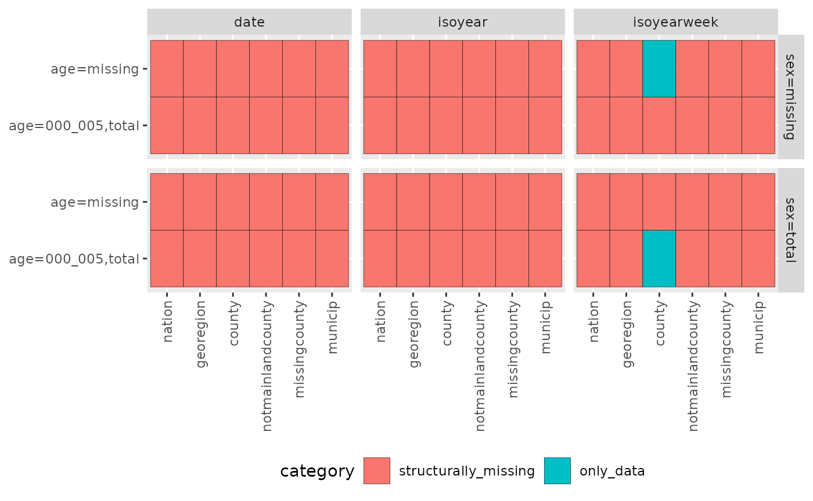

# Introduction

## csfmt_rts_data_v2

`csfmt_rts_data_v2`
([`vignette("csfmt_rts_data_v2", package = "cstidy")`](https://niphr.github.io/cstidy/articles/csfmt_rts_data_v2.md))
is the Core Surveillance data format for real-time surveillance of
infectious diseases.

``` r
d <- cstidy::generate_test_data()
cstidy::set_csfmt_rts_data_v2(d)

# Looking at the dataset
d[]
#>     granularity_time granularity_geo country_iso3 location_code border     age
#>               <char>          <char>       <char>        <char>  <int>  <char>
#>  1:      isoyearweek          county          nor  county_nor42     NA    <NA>
#>  2:      isoyearweek          county          nor  county_nor32     NA    <NA>
#>  3:      isoyearweek          county          nor  county_nor33     NA    <NA>
#>  4:      isoyearweek          county          nor  county_nor56     NA    <NA>
#>  5:      isoyearweek          county          nor  county_nor34     NA    <NA>
#>  6:      isoyearweek          county          nor  county_nor15     NA    <NA>
#>  7:      isoyearweek          county          nor  county_nor18     NA    <NA>
#>  8:      isoyearweek          county          nor  county_nor03     NA    <NA>
#>  9:      isoyearweek          county          nor  county_nor11     NA    <NA>
#> 10:      isoyearweek          county          nor  county_nor40     NA    <NA>
#> 11:      isoyearweek          county          nor  county_nor55     NA    <NA>
#> 12:      isoyearweek          county          nor  county_nor50     NA    <NA>
#> 13:      isoyearweek          county          nor  county_nor39     NA    <NA>
#> 14:      isoyearweek          county          nor  county_nor46     NA    <NA>
#> 15:      isoyearweek          county          nor  county_nor31     NA    <NA>
#> 16:      isoyearweek          county          nor  county_nor42     NA   total
#> 17:      isoyearweek          county          nor  county_nor32     NA   total
#> 18:      isoyearweek          county          nor  county_nor33     NA   total
#> 19:      isoyearweek          county          nor  county_nor56     NA   total
#> 20:      isoyearweek          county          nor  county_nor34     NA   total
#> 21:      isoyearweek          county          nor  county_nor15     NA   total
#> 22:      isoyearweek          county          nor  county_nor18     NA   total
#> 23:      isoyearweek          county          nor  county_nor03     NA   total
#> 24:      isoyearweek          county          nor  county_nor11     NA   total
#> 25:      isoyearweek          county          nor  county_nor40     NA   total
#> 26:      isoyearweek          county          nor  county_nor55     NA   total
#> 27:      isoyearweek          county          nor  county_nor50     NA   total
#> 28:      isoyearweek          county          nor  county_nor39     NA   total
#> 29:      isoyearweek          county          nor  county_nor46     NA   total
#> 30:      isoyearweek          county          nor  county_nor31     NA   total
#> 31:      isoyearweek          county          nor  county_nor42     NA 000_005
#> 32:      isoyearweek          county          nor  county_nor32     NA 000_005
#> 33:      isoyearweek          county          nor  county_nor33     NA 000_005
#> 34:      isoyearweek          county          nor  county_nor56     NA 000_005
#> 35:      isoyearweek          county          nor  county_nor34     NA 000_005
#> 36:      isoyearweek          county          nor  county_nor15     NA 000_005
#> 37:      isoyearweek          county          nor  county_nor18     NA 000_005
#> 38:      isoyearweek          county          nor  county_nor03     NA 000_005
#> 39:      isoyearweek          county          nor  county_nor11     NA 000_005
#> 40:      isoyearweek          county          nor  county_nor40     NA 000_005
#> 41:      isoyearweek          county          nor  county_nor55     NA 000_005
#> 42:      isoyearweek          county          nor  county_nor50     NA 000_005
#> 43:      isoyearweek          county          nor  county_nor39     NA 000_005
#> 44:      isoyearweek          county          nor  county_nor46     NA 000_005
#> 45:      isoyearweek          county          nor  county_nor31     NA 000_005
#>     granularity_time granularity_geo country_iso3 location_code border     age
#>               <char>          <char>       <char>        <char>  <int>  <char>
#>        sex isoyear isoweek isoyearweek isoquarter isoyearquarter    season
#>     <char>   <int>   <int>      <char>      <int>         <char>    <char>
#>  1:   <NA>    2022       3     2022-03          1        2022-Q1 2021/2022
#>  2:   <NA>    2022       3     2022-03          1        2022-Q1 2021/2022
#>  3:   <NA>    2022       3     2022-03          1        2022-Q1 2021/2022
#>  4:   <NA>    2022       3     2022-03          1        2022-Q1 2021/2022
#>  5:   <NA>    2022       3     2022-03          1        2022-Q1 2021/2022
#>  6:   <NA>    2022       3     2022-03          1        2022-Q1 2021/2022
#>  7:   <NA>    2022       3     2022-03          1        2022-Q1 2021/2022
#>  8:   <NA>    2022       3     2022-03          1        2022-Q1 2021/2022
#>  9:   <NA>    2022       3     2022-03          1        2022-Q1 2021/2022
#> 10:   <NA>    2022       3     2022-03          1        2022-Q1 2021/2022
#> 11:   <NA>    2022       3     2022-03          1        2022-Q1 2021/2022
#> 12:   <NA>    2022       3     2022-03          1        2022-Q1 2021/2022
#> 13:   <NA>    2022       3     2022-03          1        2022-Q1 2021/2022
#> 14:   <NA>    2022       3     2022-03          1        2022-Q1 2021/2022
#> 15:   <NA>    2022       3     2022-03          1        2022-Q1 2021/2022
#> 16:  total    2022       3     2022-03          1        2022-Q1 2021/2022
#> 17:  total    2022       3     2022-03          1        2022-Q1 2021/2022
#> 18:  total    2022       3     2022-03          1        2022-Q1 2021/2022
#> 19:  total    2022       3     2022-03          1        2022-Q1 2021/2022
#> 20:  total    2022       3     2022-03          1        2022-Q1 2021/2022
#> 21:  total    2022       3     2022-03          1        2022-Q1 2021/2022
#> 22:  total    2022       3     2022-03          1        2022-Q1 2021/2022
#> 23:  total    2022       3     2022-03          1        2022-Q1 2021/2022
#> 24:  total    2022       3     2022-03          1        2022-Q1 2021/2022
#> 25:  total    2022       3     2022-03          1        2022-Q1 2021/2022
#> 26:  total    2022       3     2022-03          1        2022-Q1 2021/2022
#> 27:  total    2022       3     2022-03          1        2022-Q1 2021/2022
#> 28:  total    2022       3     2022-03          1        2022-Q1 2021/2022
#> 29:  total    2022       3     2022-03          1        2022-Q1 2021/2022
#> 30:  total    2022       3     2022-03          1        2022-Q1 2021/2022
#> 31:  total    2022       3     2022-03          1        2022-Q1 2021/2022
#> 32:  total    2022       3     2022-03          1        2022-Q1 2021/2022
#> 33:  total    2022       3     2022-03          1        2022-Q1 2021/2022
#> 34:  total    2022       3     2022-03          1        2022-Q1 2021/2022
#> 35:  total    2022       3     2022-03          1        2022-Q1 2021/2022
#> 36:  total    2022       3     2022-03          1        2022-Q1 2021/2022
#> 37:  total    2022       3     2022-03          1        2022-Q1 2021/2022
#> 38:  total    2022       3     2022-03          1        2022-Q1 2021/2022
#> 39:  total    2022       3     2022-03          1        2022-Q1 2021/2022
#> 40:  total    2022       3     2022-03          1        2022-Q1 2021/2022
#> 41:  total    2022       3     2022-03          1        2022-Q1 2021/2022
#> 42:  total    2022       3     2022-03          1        2022-Q1 2021/2022
#> 43:  total    2022       3     2022-03          1        2022-Q1 2021/2022
#> 44:  total    2022       3     2022-03          1        2022-Q1 2021/2022
#> 45:  total    2022       3     2022-03          1        2022-Q1 2021/2022
#>        sex isoyear isoweek isoyearweek isoquarter isoyearquarter    season
#>     <char>   <int>   <int>      <char>      <int>         <char>    <char>
#>     seasonweek calyear calmonth calyearmonth       date deaths_n
#>          <num>   <int>    <int>       <char>     <Date>    <int>
#>  1:         21      NA       NA         <NA> 2022-01-23        2
#>  2:         21      NA       NA         <NA> 2022-01-23        7
#>  3:         21      NA       NA         <NA> 2022-01-23        5
#>  4:         21      NA       NA         <NA> 2022-01-23        3
#>  5:         21      NA       NA         <NA> 2022-01-23        1
#>  6:         21      NA       NA         <NA> 2022-01-23        5
#>  7:         21      NA       NA         <NA> 2022-01-23        5
#>  8:         21      NA       NA         <NA> 2022-01-23        4
#>  9:         21      NA       NA         <NA> 2022-01-23        6
#> 10:         21      NA       NA         <NA> 2022-01-23        7
#> 11:         21      NA       NA         <NA> 2022-01-23        8
#> 12:         21      NA       NA         <NA> 2022-01-23        3
#> 13:         21      NA       NA         <NA> 2022-01-23        1
#> 14:         21      NA       NA         <NA> 2022-01-23        4
#> 15:         21      NA       NA         <NA> 2022-01-23        4
#> 16:         21      NA       NA         <NA> 2022-01-23        2
#> 17:         21      NA       NA         <NA> 2022-01-23        7
#> 18:         21      NA       NA         <NA> 2022-01-23        5
#> 19:         21      NA       NA         <NA> 2022-01-23        3
#> 20:         21      NA       NA         <NA> 2022-01-23        1
#> 21:         21      NA       NA         <NA> 2022-01-23        5
#> 22:         21      NA       NA         <NA> 2022-01-23        5
#> 23:         21      NA       NA         <NA> 2022-01-23        4
#> 24:         21      NA       NA         <NA> 2022-01-23        6
#> 25:         21      NA       NA         <NA> 2022-01-23        7
#> 26:         21      NA       NA         <NA> 2022-01-23        8
#> 27:         21      NA       NA         <NA> 2022-01-23        3
#> 28:         21      NA       NA         <NA> 2022-01-23        1
#> 29:         21      NA       NA         <NA> 2022-01-23        4
#> 30:         21      NA       NA         <NA> 2022-01-23        4
#> 31:         21      NA       NA         <NA> 2022-01-23        2
#> 32:         21      NA       NA         <NA> 2022-01-23        7
#> 33:         21      NA       NA         <NA> 2022-01-23        5
#> 34:         21      NA       NA         <NA> 2022-01-23        3
#> 35:         21      NA       NA         <NA> 2022-01-23        1
#> 36:         21      NA       NA         <NA> 2022-01-23        5
#> 37:         21      NA       NA         <NA> 2022-01-23        5
#> 38:         21      NA       NA         <NA> 2022-01-23        4
#> 39:         21      NA       NA         <NA> 2022-01-23        6
#> 40:         21      NA       NA         <NA> 2022-01-23        7
#> 41:         21      NA       NA         <NA> 2022-01-23        8
#> 42:         21      NA       NA         <NA> 2022-01-23        3
#> 43:         21      NA       NA         <NA> 2022-01-23        1
#> 44:         21      NA       NA         <NA> 2022-01-23        4
#> 45:         21      NA       NA         <NA> 2022-01-23        4
#>     seasonweek calyear calmonth calyearmonth       date deaths_n
#>          <num>   <int>    <int>       <char>     <Date>    <int>
```

### Smart assignment

`csfmt_rts_data_v2` supports smart assignment for time and geography.
When the **bold** variables below are set with `:=`, the associated
variables are automatically derived.

**location_code**:

- granularity_geo
- country_iso3

**isoyear**:

- granularity_time
- isoweek
- isoyearweek
- season
- seasonweek
- calyear
- calmonth
- calyearmonth
- date

**isoyearweek**:

- granularity_time
- isoyear
- isoweek
- season
- seasonweek
- calyear
- calmonth
- calyearmonth
- date

**date**:

- granularity_time
- isoyear
- isoweek
- isoyearweek
- season
- seasonweek
- calyear
- calmonth
- calyearmonth

``` r
d <- cstidy::generate_test_data()[1:5]
cstidy::set_csfmt_rts_data_v2(d)

# Looking at the dataset
d[]
#>    granularity_time granularity_geo country_iso3 location_code border    age
#>              <char>          <char>       <char>        <char>  <int> <char>
#> 1:      isoyearweek          county          nor  county_nor42     NA   <NA>
#> 2:      isoyearweek          county          nor  county_nor32     NA   <NA>
#> 3:      isoyearweek          county          nor  county_nor33     NA   <NA>
#> 4:      isoyearweek          county          nor  county_nor56     NA   <NA>
#> 5:      isoyearweek          county          nor  county_nor34     NA   <NA>
#>       sex isoyear isoweek isoyearweek isoquarter isoyearquarter    season
#>    <char>   <int>   <int>      <char>      <int>         <char>    <char>
#> 1:   <NA>    2022       3     2022-03          1        2022-Q1 2021/2022
#> 2:   <NA>    2022       3     2022-03          1        2022-Q1 2021/2022
#> 3:   <NA>    2022       3     2022-03          1        2022-Q1 2021/2022
#> 4:   <NA>    2022       3     2022-03          1        2022-Q1 2021/2022
#> 5:   <NA>    2022       3     2022-03          1        2022-Q1 2021/2022
#>    seasonweek calyear calmonth calyearmonth       date deaths_n
#>         <num>   <int>    <int>       <char>     <Date>    <int>
#> 1:         21      NA       NA         <NA> 2022-01-23        3
#> 2:         21      NA       NA         <NA> 2022-01-23        4
#> 3:         21      NA       NA         <NA> 2022-01-23        2
#> 4:         21      NA       NA         <NA> 2022-01-23        4
#> 5:         21      NA       NA         <NA> 2022-01-23       10

# Smart assignment of time columns (note how granularity_time, isoyear, isoyearweek, date all change)
d[1,isoyearweek := "2021-01"]
d
#>    granularity_time granularity_geo country_iso3 location_code border    age
#>              <char>          <char>       <char>        <char>  <int> <char>
#> 1:      isoyearweek          county          nor  county_nor42     NA   <NA>
#> 2:      isoyearweek          county          nor  county_nor32     NA   <NA>
#> 3:      isoyearweek          county          nor  county_nor33     NA   <NA>
#> 4:      isoyearweek          county          nor  county_nor56     NA   <NA>
#> 5:      isoyearweek          county          nor  county_nor34     NA   <NA>
#>       sex isoyear isoweek isoyearweek isoquarter isoyearquarter    season
#>    <char>   <int>   <int>      <char>      <int>         <char>    <char>
#> 1:   <NA>    2021       1     2021-01          1        2021-Q1 2020/2021
#> 2:   <NA>    2022       3     2022-03          1        2022-Q1 2021/2022
#> 3:   <NA>    2022       3     2022-03          1        2022-Q1 2021/2022
#> 4:   <NA>    2022       3     2022-03          1        2022-Q1 2021/2022
#> 5:   <NA>    2022       3     2022-03          1        2022-Q1 2021/2022
#>    seasonweek calyear calmonth calyearmonth       date deaths_n
#>         <num>   <int>    <int>       <char>     <Date>    <int>
#> 1:         19      NA       NA         <NA> 2021-01-10        3
#> 2:         21      NA       NA         <NA> 2022-01-23        4
#> 3:         21      NA       NA         <NA> 2022-01-23        2
#> 4:         21      NA       NA         <NA> 2022-01-23        4
#> 5:         21      NA       NA         <NA> 2022-01-23       10

# Smart assignment of time columns (note how granularity_time, isoyear, isoyearweek, date all change)
d[2,isoyear := 2019]
d
#>    granularity_time granularity_geo country_iso3 location_code border    age
#>              <char>          <char>       <char>        <char>  <int> <char>
#> 1:      isoyearweek          county          nor  county_nor42     NA   <NA>
#> 2:          isoyear          county          nor  county_nor32     NA   <NA>
#> 3:      isoyearweek          county          nor  county_nor33     NA   <NA>
#> 4:      isoyearweek          county          nor  county_nor56     NA   <NA>
#> 5:      isoyearweek          county          nor  county_nor34     NA   <NA>
#>       sex isoyear isoweek isoyearweek isoquarter isoyearquarter    season
#>    <char>   <int>   <int>      <char>      <int>         <char>    <char>
#> 1:   <NA>    2021       1     2021-01          1        2021-Q1 2020/2021
#> 2:   <NA>    2019      52     2019-52          1        2022-Q1      <NA>
#> 3:   <NA>    2022       3     2022-03          1        2022-Q1 2021/2022
#> 4:   <NA>    2022       3     2022-03          1        2022-Q1 2021/2022
#> 5:   <NA>    2022       3     2022-03          1        2022-Q1 2021/2022
#>    seasonweek calyear calmonth calyearmonth       date deaths_n
#>         <num>   <int>    <int>       <char>     <Date>    <int>
#> 1:         19      NA       NA         <NA> 2021-01-10        3
#> 2:         NA      NA       NA         <NA> 2019-12-29        4
#> 3:         21      NA       NA         <NA> 2022-01-23        2
#> 4:         21      NA       NA         <NA> 2022-01-23        4
#> 5:         21      NA       NA         <NA> 2022-01-23       10

# Smart assignment of time columns (note how granularity_time, isoyear, isoyearweek, date all change)
d[4:5,date := as.Date("2020-01-01")]
d
#>    granularity_time granularity_geo country_iso3 location_code border    age
#>              <char>          <char>       <char>        <char>  <int> <char>
#> 1:      isoyearweek          county          nor  county_nor42     NA   <NA>
#> 2:          isoyear          county          nor  county_nor32     NA   <NA>
#> 3:      isoyearweek          county          nor  county_nor33     NA   <NA>
#> 4:             date          county          nor  county_nor56     NA   <NA>
#> 5:             date          county          nor  county_nor34     NA   <NA>
#>       sex isoyear isoweek isoyearweek isoquarter isoyearquarter    season
#>    <char>   <int>   <int>      <char>      <int>         <char>    <char>
#> 1:   <NA>    2021       1     2021-01          1        2021-Q1 2020/2021
#> 2:   <NA>    2019      52     2019-52          1        2022-Q1      <NA>
#> 3:   <NA>    2022       3     2022-03          1        2022-Q1 2021/2022
#> 4:   <NA>    2020       1     2020-01          1        2020-Q1 2019/2020
#> 5:   <NA>    2020       1     2020-01          1        2020-Q1 2019/2020
#>    seasonweek calyear calmonth calyearmonth       date deaths_n
#>         <num>   <int>    <int>       <char>     <Date>    <int>
#> 1:         19      NA       NA         <NA> 2021-01-10        3
#> 2:         NA      NA       NA         <NA> 2019-12-29        4
#> 3:         21      NA       NA         <NA> 2022-01-23        2
#> 4:         19    2020        1     2020-M01 2020-01-01        4
#> 5:         19    2020        1     2020-M01 2020-01-01       10

# Smart assignment fails when multiple time columns are set
d[1,c("isoyear","isoyearweek") := .(2021,"2021-01")]
#> Warning in `[.csfmt_rts_data_v2`(d, 1, `:=`(c("isoyear", "isoyearweek"), :
#> Multiple time variables specified. Smart-assignment disabled.
d
#>    granularity_time granularity_geo country_iso3 location_code border    age
#>              <char>          <char>       <char>        <char>  <int> <char>
#> 1:      isoyearweek          county          nor  county_nor42     NA   <NA>
#> 2:          isoyear          county          nor  county_nor32     NA   <NA>
#> 3:      isoyearweek          county          nor  county_nor33     NA   <NA>
#> 4:             date          county          nor  county_nor56     NA   <NA>
#> 5:             date          county          nor  county_nor34     NA   <NA>
#>       sex isoyear isoweek isoyearweek isoquarter isoyearquarter    season
#>    <char>   <int>   <int>      <char>      <int>         <char>    <char>
#> 1:   <NA>    2021       1     2021-01          1        2021-Q1 2020/2021
#> 2:   <NA>    2019      52     2019-52          1        2022-Q1      <NA>
#> 3:   <NA>    2022       3     2022-03          1        2022-Q1 2021/2022
#> 4:   <NA>    2020       1     2020-01          1        2020-Q1 2019/2020
#> 5:   <NA>    2020       1     2020-01          1        2020-Q1 2019/2020
#>    seasonweek calyear calmonth calyearmonth       date deaths_n
#>         <num>   <int>    <int>       <char>     <Date>    <int>
#> 1:         19      NA       NA         <NA> 2021-01-10        3
#> 2:         NA      NA       NA         <NA> 2019-12-29        4
#> 3:         21      NA       NA         <NA> 2022-01-23        2
#> 4:         19    2020        1     2020-M01 2020-01-01        4
#> 5:         19    2020        1     2020-M01 2020-01-01       10

# Smart assignment of geo columns
d[1,c("location_code") := .("norge")]
d
#>    granularity_time granularity_geo country_iso3 location_code border    age
#>              <char>          <char>       <char>        <char>  <int> <char>
#> 1:      isoyearweek          nation          nor         norge     NA   <NA>
#> 2:          isoyear          county          nor  county_nor32     NA   <NA>
#> 3:      isoyearweek          county          nor  county_nor33     NA   <NA>
#> 4:             date          county          nor  county_nor56     NA   <NA>
#> 5:             date          county          nor  county_nor34     NA   <NA>
#>       sex isoyear isoweek isoyearweek isoquarter isoyearquarter    season
#>    <char>   <int>   <int>      <char>      <int>         <char>    <char>
#> 1:   <NA>    2021       1     2021-01          1        2021-Q1 2020/2021
#> 2:   <NA>    2019      52     2019-52          1        2022-Q1      <NA>
#> 3:   <NA>    2022       3     2022-03          1        2022-Q1 2021/2022
#> 4:   <NA>    2020       1     2020-01          1        2020-Q1 2019/2020
#> 5:   <NA>    2020       1     2020-01          1        2020-Q1 2019/2020
#>    seasonweek calyear calmonth calyearmonth       date deaths_n
#>         <num>   <int>    <int>       <char>     <Date>    <int>
#> 1:         19      NA       NA         <NA> 2021-01-10        3
#> 2:         NA      NA       NA         <NA> 2019-12-29        4
#> 3:         21      NA       NA         <NA> 2022-01-23        2
#> 4:         19    2020        1     2020-M01 2020-01-01        4
#> 5:         19    2020        1     2020-M01 2020-01-01       10

# Collapsing down to different levels, and healing the dataset 
# (so that it can be worked on further with regards to real time surveillance)
d[, .(deaths_n = sum(deaths_n), location_code = "norge"), keyby=.(granularity_time)] %>%
  cstidy::set_csfmt_rts_data_v2(create_unified_columns = FALSE) %>%
  print()
#>    granularity_time deaths_n location_code   date
#>              <char>    <int>        <char> <Date>
#> 1:             date       14         norge   <NA>
#> 2:          isoyear        4         norge   <NA>
#> 3:      isoyearweek        5         norge   <NA>

# Collapsing to different levels, and removing the class csfmt_rts_data_v2 because
# it is going to be used in new output/analyses
d[, .(deaths_n = sum(deaths_n), location_code = "norge"), keyby=.(granularity_time)] %>%
  cstidy::remove_class_csfmt_rts_data() %>%
  print()
#> Key: <granularity_time>
#>    granularity_time deaths_n location_code
#>              <char>    <int>        <char>
#> 1:             date       14         norge
#> 2:          isoyear        4         norge
#> 3:      isoyearweek        5         norge
```

### Summary

[`summary()`](https://rdrr.io/r/base/summary.html) gives a concise
overview of the data structure.

``` r
cstidy::generate_test_data() %>%
  cstidy::set_csfmt_rts_data_v2() %>%
  summary()
#> 
#> granularity_time
#> ✅ No errors
#> 
#> granularity_geo
#> ✅ No errors
#> 
#> country_iso3
#> ✅ No errors
#> 
#> location_code
#> ✅ No errors
#> 
#> border
#> ❌ Errors:
#> - NA exists (not allowed)
#> 
#> age
#> ✅ No errors
#> 
#> sex
#> ✅ No errors
#> 
#> isoyear
#> ✅ No errors
#> 
#> isoweek
#> ✅ No errors
#> 
#> isoyearweek
#> ✅ No errors
#> 
#> isoquarter
#> ✅ No errors
#> 
#> isoyearquarter
#> ✅ No errors
#> 
#> season
#> ✅ No errors
#> 
#> seasonweek
#> ✅ No errors
#> 
#> calyear
#> ✅ No errors
#> 
#> calmonth
#> ✅ No errors
#> 
#> calyearmonth
#> ✅ No errors
#> 
#> date
#> ✅ No errors
#> granularity_time (character):
#>  - isoyearweek (n = 45)
#> granularity_geo (character):
#>  - county (n = 45)
#> country_iso3 (character):
#>  - nor (n = 45)
#> location_code (character)
#> border (integer):
#>  - <NA> (n = 45)
#> age (character):
#>  - <NA>    (n = 15)
#>  - 000_005 (n = 15)
#>  - total   (n = 15)
#> sex (character):
#>  - <NA>  (n = 15)
#>  - total (n = 30)
#> isoyear (integer):
#>  - 2022 (n = 45)
#> isoweek (integer)
#> isoyearweek (character)
#> isoquarter (integer)
#> isoyearquarter (character)
#> season (character):
#>  - 2021/2022 (n = 45)
#> seasonweek (numeric)
#> calyear (integer)
#> calmonth (integer)
#> calyearmonth (character)
#> date (Date)
#> deaths_n (integer)
```

### Identifying the data structure of one column

[`cstidy::identify_data_structure()`](https://niphr.github.io/cstidy/reference/identify_data_structure.md)
inspects a single column and returns a plottable object.

``` r
cstidy::generate_test_data() %>%
  cstidy::set_csfmt_rts_data_v2() %>%
  cstidy::identify_data_structure("deaths_n") %>%
  plot()
```


