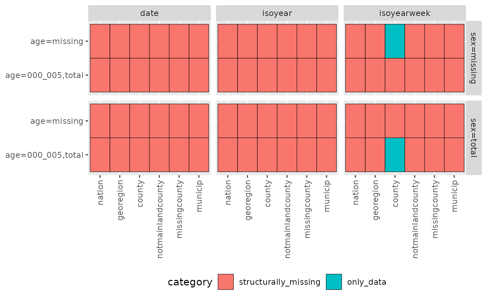

# Introduction

## What cstidy is for

cstidy puts aggregated surveillance data into one standard shape: a
`csfmt_rts_data` table. You give it counts that already carry a time
column and a location column. It fills in the rest of the time and
geography columns that the shape requires, so everything downstream can
assume those columns are there.

cstidy does not turn individual records into counts. Aggregate first,
then hand the result to cstidy.

## Which format to use

Use **`csfmt_rts_data_v3`**, through
[`set_csfmt_rts_data_v3()`](https://niphr.github.io/cstidy/reference/set_csfmt_rts_data_v3.md).
It is the current format and what new work should target.

**`csfmt_rts_data_v1` and `csfmt_rts_data_v2` are deprecated.** The mark
is a signpost, not an alarm. Neither format prints a deprecation
warning, and the mark changed no executable line, so nothing you have
running will break or start complaining. The rest of this page documents
v2 and is still accurate. Do not start there.

The three formats are siblings. None of them inherits from another.

``` r
d1 <- cstidy::generate_test_data()
d2 <- cstidy::generate_test_data()
d3 <- cstidy::generate_test_data()

cstidy::set_csfmt_rts_data_v1(d1)
cstidy::set_csfmt_rts_data_v2(d2)
cstidy::set_csfmt_rts_data_v3(d3)

class(d1)
#> [1] "csfmt_rts_data_v1" "data.table"        "data.frame"
class(d2)
#> [1] "csfmt_rts_data_v2" "data.table"        "data.frame"
class(d3)
#> [1] "csfmt_rts_data_v3" "data.table"        "data.frame"

inherits(d3, "csfmt_rts_data_v2")
#> [1] FALSE
```

## Three things to know before you move to v3

### v3 derives fewer columns, and removes none

Each format carries the list of columns it derives when the input lacks
them. v2’s list holds 18 columns; v3’s holds 11.

Deriving is not removing.
[`set_csfmt_rts_data_v3()`](https://niphr.github.io/cstidy/reference/set_csfmt_rts_data_v3.md)
takes no column away, so a table built under v2 keeps every column it
had. What a move to v3 costs is the guarantee that those columns are
present, not the values in them.

``` r
length(attr(d2, "format_unified"))
#> [1] 18
length(attr(d3, "format_unified"))
#> [1] 11

d <- cstidy::generate_test_data()
cstidy::set_csfmt_rts_data_v2(d)
ncol(d)
#> [1] 19

# Take the old class off first. set_csfmt_rts_data_v3() on a table that is
# still csfmt_rts_data_v2 leaves it a csfmt_rts_data_v2.
cstidy::remove_class_csfmt_rts_data(d)
cstidy::set_csfmt_rts_data_v3(d)
ncol(d)
#> [1] 19
class(d)
#> [1] "csfmt_rts_data_v3" "data.table"        "data.frame"
```

### v3 is weekly only

v3 fills in the time columns from `isoyearweek` and from nothing else.
Weekly data comes out complete.

A daily table keeps its `date` values and gets NA in every other time
column. Data that is not weekly stays on v2.

``` r
weekly <- data.table::data.table(
  isoyearweek = c("2020-34", "2020-35"),
  location_code = "nation_nor",
  deaths_n = c(1L, 2L)
)
cstidy::set_csfmt_rts_data_v3(weekly)
weekly[, .(isoyearweek, isoyear, isoweek, season, seasonweek, date)]
#>    isoyearweek isoyear isoweek    season seasonweek       date
#>         <char>   <int>   <int>    <char>      <num>     <Date>
#> 1:     2020-34    2020      34 2019/2020         52 2020-08-23
#> 2:     2020-35    2020      35 2020/2021          1 2020-08-30

daily <- data.table::data.table(
  granularity_time = "date",
  date = as.Date(c("2020-08-17", "2020-08-18")),
  location_code = "nation_nor",
  deaths_n = c(1L, 2L)
)
cstidy::set_csfmt_rts_data_v3(daily)
daily[, .(date, isoyear, isoweek, isoyearweek, season, seasonweek)]
#>          date isoyear isoweek isoyearweek season seasonweek
#>        <Date>   <int>   <int>      <char> <char>      <num>
#> 1: 2020-08-17      NA      NA        <NA>   <NA>         NA
#> 2: 2020-08-18      NA      NA        <NA>   <NA>         NA
```

### csdb cannot check a v3 table, though it can store one

`csdb` ships table validators for `csfmt_rts_data_v1` and
`csfmt_rts_data_v2`, and nothing for v3, so a v3 column set fails both.
That does not stop you storing it. The validator is an ordinary argument
to `csdb::DBTable_v9$new()`: pass `validator_field_types_blank()`, or a
function of your own, and the table writes. What you give up is the
column check on the way in, not the storage.

## Where cstidy sits

cstidy imports `csdata` for Norwegian geography and `cstime` for time
conversions. It feeds `csalert`, whose `ens_collapse(heal = TRUE)`
returns a `csfmt_rts_data_v3`.

## Where to read next

- [`vignette("csfmt_rts_data_v2", package = "cstidy")`](https://niphr.github.io/cstidy/articles/csfmt_rts_data_v2.md)
  — the column-by-column reference for v2.
- [`vignette("benchmarks", package = "cstidy")`](https://niphr.github.io/cstidy/articles/benchmarks.md)
  — timings.
- [`?set_csfmt_rts_data_v3`](https://niphr.github.io/cstidy/reference/set_csfmt_rts_data_v3.md)
  — the v3 reference. No vignette covers v3 yet.

Everything below documents `csfmt_rts_data_v2`.

## csfmt_rts_data_v2

`csfmt_rts_data_v2`
([`vignette("csfmt_rts_data_v2", package = "cstidy")`](https://niphr.github.io/cstidy/articles/csfmt_rts_data_v2.md))
is the Core Surveillance data format for real-time surveillance of
infectious diseases.

``` r
d <- cstidy::generate_test_data()
cstidy::set_csfmt_rts_data_v2(d)

# Looking at the dataset
d[]
#>     granularity_time granularity_geo country_iso3 location_code border     age
#>               <char>          <char>       <char>        <char>  <int>  <char>
#>  1:      isoyearweek          county          nor  county_nor42     NA    <NA>
#>  2:      isoyearweek          county          nor  county_nor32     NA    <NA>
#>  3:      isoyearweek          county          nor  county_nor33     NA    <NA>
#>  4:      isoyearweek          county          nor  county_nor56     NA    <NA>
#>  5:      isoyearweek          county          nor  county_nor34     NA    <NA>
#>  6:      isoyearweek          county          nor  county_nor15     NA    <NA>
#>  7:      isoyearweek          county          nor  county_nor18     NA    <NA>
#>  8:      isoyearweek          county          nor  county_nor03     NA    <NA>
#>  9:      isoyearweek          county          nor  county_nor11     NA    <NA>
#> 10:      isoyearweek          county          nor  county_nor40     NA    <NA>
#> 11:      isoyearweek          county          nor  county_nor55     NA    <NA>
#> 12:      isoyearweek          county          nor  county_nor50     NA    <NA>
#> 13:      isoyearweek          county          nor  county_nor39     NA    <NA>
#> 14:      isoyearweek          county          nor  county_nor46     NA    <NA>
#> 15:      isoyearweek          county          nor  county_nor31     NA    <NA>
#> 16:      isoyearweek          county          nor  county_nor42     NA   total
#> 17:      isoyearweek          county          nor  county_nor32     NA   total
#> 18:      isoyearweek          county          nor  county_nor33     NA   total
#> 19:      isoyearweek          county          nor  county_nor56     NA   total
#> 20:      isoyearweek          county          nor  county_nor34     NA   total
#> 21:      isoyearweek          county          nor  county_nor15     NA   total
#> 22:      isoyearweek          county          nor  county_nor18     NA   total
#> 23:      isoyearweek          county          nor  county_nor03     NA   total
#> 24:      isoyearweek          county          nor  county_nor11     NA   total
#> 25:      isoyearweek          county          nor  county_nor40     NA   total
#> 26:      isoyearweek          county          nor  county_nor55     NA   total
#> 27:      isoyearweek          county          nor  county_nor50     NA   total
#> 28:      isoyearweek          county          nor  county_nor39     NA   total
#> 29:      isoyearweek          county          nor  county_nor46     NA   total
#> 30:      isoyearweek          county          nor  county_nor31     NA   total
#> 31:      isoyearweek          county          nor  county_nor42     NA 000_005
#> 32:      isoyearweek          county          nor  county_nor32     NA 000_005
#> 33:      isoyearweek          county          nor  county_nor33     NA 000_005
#> 34:      isoyearweek          county          nor  county_nor56     NA 000_005
#> 35:      isoyearweek          county          nor  county_nor34     NA 000_005
#> 36:      isoyearweek          county          nor  county_nor15     NA 000_005
#> 37:      isoyearweek          county          nor  county_nor18     NA 000_005
#> 38:      isoyearweek          county          nor  county_nor03     NA 000_005
#> 39:      isoyearweek          county          nor  county_nor11     NA 000_005
#> 40:      isoyearweek          county          nor  county_nor40     NA 000_005
#> 41:      isoyearweek          county          nor  county_nor55     NA 000_005
#> 42:      isoyearweek          county          nor  county_nor50     NA 000_005
#> 43:      isoyearweek          county          nor  county_nor39     NA 000_005
#> 44:      isoyearweek          county          nor  county_nor46     NA 000_005
#> 45:      isoyearweek          county          nor  county_nor31     NA 000_005
#>     granularity_time granularity_geo country_iso3 location_code border     age
#>               <char>          <char>       <char>        <char>  <int>  <char>
#>        sex isoyear isoweek isoyearweek isoquarter isoyearquarter    season
#>     <char>   <int>   <int>      <char>      <int>         <char>    <char>
#>  1:   <NA>    2022       3     2022-03          1        2022-Q1 2021/2022
#>  2:   <NA>    2022       3     2022-03          1        2022-Q1 2021/2022
#>  3:   <NA>    2022       3     2022-03          1        2022-Q1 2021/2022
#>  4:   <NA>    2022       3     2022-03          1        2022-Q1 2021/2022
#>  5:   <NA>    2022       3     2022-03          1        2022-Q1 2021/2022
#>  6:   <NA>    2022       3     2022-03          1        2022-Q1 2021/2022
#>  7:   <NA>    2022       3     2022-03          1        2022-Q1 2021/2022
#>  8:   <NA>    2022       3     2022-03          1        2022-Q1 2021/2022
#>  9:   <NA>    2022       3     2022-03          1        2022-Q1 2021/2022
#> 10:   <NA>    2022       3     2022-03          1        2022-Q1 2021/2022
#> 11:   <NA>    2022       3     2022-03          1        2022-Q1 2021/2022
#> 12:   <NA>    2022       3     2022-03          1        2022-Q1 2021/2022
#> 13:   <NA>    2022       3     2022-03          1        2022-Q1 2021/2022
#> 14:   <NA>    2022       3     2022-03          1        2022-Q1 2021/2022
#> 15:   <NA>    2022       3     2022-03          1        2022-Q1 2021/2022
#> 16:  total    2022       3     2022-03          1        2022-Q1 2021/2022
#> 17:  total    2022       3     2022-03          1        2022-Q1 2021/2022
#> 18:  total    2022       3     2022-03          1        2022-Q1 2021/2022
#> 19:  total    2022       3     2022-03          1        2022-Q1 2021/2022
#> 20:  total    2022       3     2022-03          1        2022-Q1 2021/2022
#> 21:  total    2022       3     2022-03          1        2022-Q1 2021/2022
#> 22:  total    2022       3     2022-03          1        2022-Q1 2021/2022
#> 23:  total    2022       3     2022-03          1        2022-Q1 2021/2022
#> 24:  total    2022       3     2022-03          1        2022-Q1 2021/2022
#> 25:  total    2022       3     2022-03          1        2022-Q1 2021/2022
#> 26:  total    2022       3     2022-03          1        2022-Q1 2021/2022
#> 27:  total    2022       3     2022-03          1        2022-Q1 2021/2022
#> 28:  total    2022       3     2022-03          1        2022-Q1 2021/2022
#> 29:  total    2022       3     2022-03          1        2022-Q1 2021/2022
#> 30:  total    2022       3     2022-03          1        2022-Q1 2021/2022
#> 31:  total    2022       3     2022-03          1        2022-Q1 2021/2022
#> 32:  total    2022       3     2022-03          1        2022-Q1 2021/2022
#> 33:  total    2022       3     2022-03          1        2022-Q1 2021/2022
#> 34:  total    2022       3     2022-03          1        2022-Q1 2021/2022
#> 35:  total    2022       3     2022-03          1        2022-Q1 2021/2022
#> 36:  total    2022       3     2022-03          1        2022-Q1 2021/2022
#> 37:  total    2022       3     2022-03          1        2022-Q1 2021/2022
#> 38:  total    2022       3     2022-03          1        2022-Q1 2021/2022
#> 39:  total    2022       3     2022-03          1        2022-Q1 2021/2022
#> 40:  total    2022       3     2022-03          1        2022-Q1 2021/2022
#> 41:  total    2022       3     2022-03          1        2022-Q1 2021/2022
#> 42:  total    2022       3     2022-03          1        2022-Q1 2021/2022
#> 43:  total    2022       3     2022-03          1        2022-Q1 2021/2022
#> 44:  total    2022       3     2022-03          1        2022-Q1 2021/2022
#> 45:  total    2022       3     2022-03          1        2022-Q1 2021/2022
#>        sex isoyear isoweek isoyearweek isoquarter isoyearquarter    season
#>     <char>   <int>   <int>      <char>      <int>         <char>    <char>
#>     seasonweek calyear calmonth calyearmonth       date deaths_n
#>          <num>   <int>    <int>       <char>     <Date>    <int>
#>  1:         21      NA       NA         <NA> 2022-01-23        7
#>  2:         21      NA       NA         <NA> 2022-01-23        4
#>  3:         21      NA       NA         <NA> 2022-01-23        5
#>  4:         21      NA       NA         <NA> 2022-01-23        4
#>  5:         21      NA       NA         <NA> 2022-01-23        5
#>  6:         21      NA       NA         <NA> 2022-01-23        3
#>  7:         21      NA       NA         <NA> 2022-01-23        9
#>  8:         21      NA       NA         <NA> 2022-01-23        5
#>  9:         21      NA       NA         <NA> 2022-01-23        5
#> 10:         21      NA       NA         <NA> 2022-01-23        4
#> 11:         21      NA       NA         <NA> 2022-01-23        5
#> 12:         21      NA       NA         <NA> 2022-01-23        4
#> 13:         21      NA       NA         <NA> 2022-01-23        1
#> 14:         21      NA       NA         <NA> 2022-01-23        5
#> 15:         21      NA       NA         <NA> 2022-01-23        4
#> 16:         21      NA       NA         <NA> 2022-01-23        7
#> 17:         21      NA       NA         <NA> 2022-01-23        4
#> 18:         21      NA       NA         <NA> 2022-01-23        5
#> 19:         21      NA       NA         <NA> 2022-01-23        4
#> 20:         21      NA       NA         <NA> 2022-01-23        5
#> 21:         21      NA       NA         <NA> 2022-01-23        3
#> 22:         21      NA       NA         <NA> 2022-01-23        9
#> 23:         21      NA       NA         <NA> 2022-01-23        5
#> 24:         21      NA       NA         <NA> 2022-01-23        5
#> 25:         21      NA       NA         <NA> 2022-01-23        4
#> 26:         21      NA       NA         <NA> 2022-01-23        5
#> 27:         21      NA       NA         <NA> 2022-01-23        4
#> 28:         21      NA       NA         <NA> 2022-01-23        1
#> 29:         21      NA       NA         <NA> 2022-01-23        5
#> 30:         21      NA       NA         <NA> 2022-01-23        4
#> 31:         21      NA       NA         <NA> 2022-01-23        7
#> 32:         21      NA       NA         <NA> 2022-01-23        4
#> 33:         21      NA       NA         <NA> 2022-01-23        5
#> 34:         21      NA       NA         <NA> 2022-01-23        4
#> 35:         21      NA       NA         <NA> 2022-01-23        5
#> 36:         21      NA       NA         <NA> 2022-01-23        3
#> 37:         21      NA       NA         <NA> 2022-01-23        9
#> 38:         21      NA       NA         <NA> 2022-01-23        5
#> 39:         21      NA       NA         <NA> 2022-01-23        5
#> 40:         21      NA       NA         <NA> 2022-01-23        4
#> 41:         21      NA       NA         <NA> 2022-01-23        5
#> 42:         21      NA       NA         <NA> 2022-01-23        4
#> 43:         21      NA       NA         <NA> 2022-01-23        1
#> 44:         21      NA       NA         <NA> 2022-01-23        5
#> 45:         21      NA       NA         <NA> 2022-01-23        4
#>     seasonweek calyear calmonth calyearmonth       date deaths_n
#>          <num>   <int>    <int>       <char>     <Date>    <int>
```

### Smart assignment

`csfmt_rts_data_v2` supports smart assignment for time and geography.
When the **bold** variables below are set with `:=`, the associated
variables are automatically derived.

**location_code**:

- granularity_geo
- country_iso3

**isoyear**:

- granularity_time
- isoweek
- isoyearweek
- season
- seasonweek
- calyear
- calmonth
- calyearmonth
- date

**isoyearweek**:

- granularity_time
- isoyear
- isoweek
- season
- seasonweek
- calyear
- calmonth
- calyearmonth
- date

**date**:

- granularity_time
- isoyear
- isoweek
- isoyearweek
- season
- seasonweek
- calyear
- calmonth
- calyearmonth

``` r
d <- cstidy::generate_test_data()[1:5]
cstidy::set_csfmt_rts_data_v2(d)

# Looking at the dataset
d[]
#>    granularity_time granularity_geo country_iso3 location_code border    age
#>              <char>          <char>       <char>        <char>  <int> <char>
#> 1:      isoyearweek          county          nor  county_nor42     NA   <NA>
#> 2:      isoyearweek          county          nor  county_nor32     NA   <NA>
#> 3:      isoyearweek          county          nor  county_nor33     NA   <NA>
#> 4:      isoyearweek          county          nor  county_nor56     NA   <NA>
#> 5:      isoyearweek          county          nor  county_nor34     NA   <NA>
#>       sex isoyear isoweek isoyearweek isoquarter isoyearquarter    season
#>    <char>   <int>   <int>      <char>      <int>         <char>    <char>
#> 1:   <NA>    2022       3     2022-03          1        2022-Q1 2021/2022
#> 2:   <NA>    2022       3     2022-03          1        2022-Q1 2021/2022
#> 3:   <NA>    2022       3     2022-03          1        2022-Q1 2021/2022
#> 4:   <NA>    2022       3     2022-03          1        2022-Q1 2021/2022
#> 5:   <NA>    2022       3     2022-03          1        2022-Q1 2021/2022
#>    seasonweek calyear calmonth calyearmonth       date deaths_n
#>         <num>   <int>    <int>       <char>     <Date>    <int>
#> 1:         21      NA       NA         <NA> 2022-01-23        1
#> 2:         21      NA       NA         <NA> 2022-01-23        4
#> 3:         21      NA       NA         <NA> 2022-01-23        5
#> 4:         21      NA       NA         <NA> 2022-01-23        7
#> 5:         21      NA       NA         <NA> 2022-01-23        4

# Smart assignment of time columns (note how granularity_time, isoyear, isoyearweek, date all change)
d[1,isoyearweek := "2021-01"]
d
#>    granularity_time granularity_geo country_iso3 location_code border    age
#>              <char>          <char>       <char>        <char>  <int> <char>
#> 1:      isoyearweek          county          nor  county_nor42     NA   <NA>
#> 2:      isoyearweek          county          nor  county_nor32     NA   <NA>
#> 3:      isoyearweek          county          nor  county_nor33     NA   <NA>
#> 4:      isoyearweek          county          nor  county_nor56     NA   <NA>
#> 5:      isoyearweek          county          nor  county_nor34     NA   <NA>
#>       sex isoyear isoweek isoyearweek isoquarter isoyearquarter    season
#>    <char>   <int>   <int>      <char>      <int>         <char>    <char>
#> 1:   <NA>    2021       1     2021-01          1        2021-Q1 2020/2021
#> 2:   <NA>    2022       3     2022-03          1        2022-Q1 2021/2022
#> 3:   <NA>    2022       3     2022-03          1        2022-Q1 2021/2022
#> 4:   <NA>    2022       3     2022-03          1        2022-Q1 2021/2022
#> 5:   <NA>    2022       3     2022-03          1        2022-Q1 2021/2022
#>    seasonweek calyear calmonth calyearmonth       date deaths_n
#>         <num>   <int>    <int>       <char>     <Date>    <int>
#> 1:         19      NA       NA         <NA> 2021-01-10        1
#> 2:         21      NA       NA         <NA> 2022-01-23        4
#> 3:         21      NA       NA         <NA> 2022-01-23        5
#> 4:         21      NA       NA         <NA> 2022-01-23        7
#> 5:         21      NA       NA         <NA> 2022-01-23        4

# Smart assignment of time columns (note how granularity_time, isoyear, isoyearweek, date all change)
d[2,isoyear := 2019]
d
#>    granularity_time granularity_geo country_iso3 location_code border    age
#>              <char>          <char>       <char>        <char>  <int> <char>
#> 1:      isoyearweek          county          nor  county_nor42     NA   <NA>
#> 2:          isoyear          county          nor  county_nor32     NA   <NA>
#> 3:      isoyearweek          county          nor  county_nor33     NA   <NA>
#> 4:      isoyearweek          county          nor  county_nor56     NA   <NA>
#> 5:      isoyearweek          county          nor  county_nor34     NA   <NA>
#>       sex isoyear isoweek isoyearweek isoquarter isoyearquarter    season
#>    <char>   <int>   <int>      <char>      <int>         <char>    <char>
#> 1:   <NA>    2021       1     2021-01          1        2021-Q1 2020/2021
#> 2:   <NA>    2019      52     2019-52          1        2022-Q1      <NA>
#> 3:   <NA>    2022       3     2022-03          1        2022-Q1 2021/2022
#> 4:   <NA>    2022       3     2022-03          1        2022-Q1 2021/2022
#> 5:   <NA>    2022       3     2022-03          1        2022-Q1 2021/2022
#>    seasonweek calyear calmonth calyearmonth       date deaths_n
#>         <num>   <int>    <int>       <char>     <Date>    <int>
#> 1:         19      NA       NA         <NA> 2021-01-10        1
#> 2:         NA      NA       NA         <NA> 2019-12-29        4
#> 3:         21      NA       NA         <NA> 2022-01-23        5
#> 4:         21      NA       NA         <NA> 2022-01-23        7
#> 5:         21      NA       NA         <NA> 2022-01-23        4

# Smart assignment of time columns (note how granularity_time, isoyear, isoyearweek, date all change)
d[4:5,date := as.Date("2020-01-01")]
d
#>    granularity_time granularity_geo country_iso3 location_code border    age
#>              <char>          <char>       <char>        <char>  <int> <char>
#> 1:      isoyearweek          county          nor  county_nor42     NA   <NA>
#> 2:          isoyear          county          nor  county_nor32     NA   <NA>
#> 3:      isoyearweek          county          nor  county_nor33     NA   <NA>
#> 4:             date          county          nor  county_nor56     NA   <NA>
#> 5:             date          county          nor  county_nor34     NA   <NA>
#>       sex isoyear isoweek isoyearweek isoquarter isoyearquarter    season
#>    <char>   <int>   <int>      <char>      <int>         <char>    <char>
#> 1:   <NA>    2021       1     2021-01          1        2021-Q1 2020/2021
#> 2:   <NA>    2019      52     2019-52          1        2022-Q1      <NA>
#> 3:   <NA>    2022       3     2022-03          1        2022-Q1 2021/2022
#> 4:   <NA>    2020       1     2020-01          1        2020-Q1 2019/2020
#> 5:   <NA>    2020       1     2020-01          1        2020-Q1 2019/2020
#>    seasonweek calyear calmonth calyearmonth       date deaths_n
#>         <num>   <int>    <int>       <char>     <Date>    <int>
#> 1:         19      NA       NA         <NA> 2021-01-10        1
#> 2:         NA      NA       NA         <NA> 2019-12-29        4
#> 3:         21      NA       NA         <NA> 2022-01-23        5
#> 4:         19    2020        1     2020-M01 2020-01-01        7
#> 5:         19    2020        1     2020-M01 2020-01-01        4

# Smart assignment fails when multiple time columns are set
d[1,c("isoyear","isoyearweek") := .(2021,"2021-01")]
#> Warning in `[.csfmt_rts_data_v2`(d, 1, `:=`(c("isoyear", "isoyearweek"), :
#> Multiple time variables specified. Smart-assignment disabled.
d
#>    granularity_time granularity_geo country_iso3 location_code border    age
#>              <char>          <char>       <char>        <char>  <int> <char>
#> 1:      isoyearweek          county          nor  county_nor42     NA   <NA>
#> 2:          isoyear          county          nor  county_nor32     NA   <NA>
#> 3:      isoyearweek          county          nor  county_nor33     NA   <NA>
#> 4:             date          county          nor  county_nor56     NA   <NA>
#> 5:             date          county          nor  county_nor34     NA   <NA>
#>       sex isoyear isoweek isoyearweek isoquarter isoyearquarter    season
#>    <char>   <int>   <int>      <char>      <int>         <char>    <char>
#> 1:   <NA>    2021       1     2021-01          1        2021-Q1 2020/2021
#> 2:   <NA>    2019      52     2019-52          1        2022-Q1      <NA>
#> 3:   <NA>    2022       3     2022-03          1        2022-Q1 2021/2022
#> 4:   <NA>    2020       1     2020-01          1        2020-Q1 2019/2020
#> 5:   <NA>    2020       1     2020-01          1        2020-Q1 2019/2020
#>    seasonweek calyear calmonth calyearmonth       date deaths_n
#>         <num>   <int>    <int>       <char>     <Date>    <int>
#> 1:         19      NA       NA         <NA> 2021-01-10        1
#> 2:         NA      NA       NA         <NA> 2019-12-29        4
#> 3:         21      NA       NA         <NA> 2022-01-23        5
#> 4:         19    2020        1     2020-M01 2020-01-01        7
#> 5:         19    2020        1     2020-M01 2020-01-01        4

# Smart assignment of geo columns
d[1,c("location_code") := .("norge")]
d
#>    granularity_time granularity_geo country_iso3 location_code border    age
#>              <char>          <char>       <char>        <char>  <int> <char>
#> 1:      isoyearweek          nation          nor         norge     NA   <NA>
#> 2:          isoyear          county          nor  county_nor32     NA   <NA>
#> 3:      isoyearweek          county          nor  county_nor33     NA   <NA>
#> 4:             date          county          nor  county_nor56     NA   <NA>
#> 5:             date          county          nor  county_nor34     NA   <NA>
#>       sex isoyear isoweek isoyearweek isoquarter isoyearquarter    season
#>    <char>   <int>   <int>      <char>      <int>         <char>    <char>
#> 1:   <NA>    2021       1     2021-01          1        2021-Q1 2020/2021
#> 2:   <NA>    2019      52     2019-52          1        2022-Q1      <NA>
#> 3:   <NA>    2022       3     2022-03          1        2022-Q1 2021/2022
#> 4:   <NA>    2020       1     2020-01          1        2020-Q1 2019/2020
#> 5:   <NA>    2020       1     2020-01          1        2020-Q1 2019/2020
#>    seasonweek calyear calmonth calyearmonth       date deaths_n
#>         <num>   <int>    <int>       <char>     <Date>    <int>
#> 1:         19      NA       NA         <NA> 2021-01-10        1
#> 2:         NA      NA       NA         <NA> 2019-12-29        4
#> 3:         21      NA       NA         <NA> 2022-01-23        5
#> 4:         19    2020        1     2020-M01 2020-01-01        7
#> 5:         19    2020        1     2020-M01 2020-01-01        4

# Collapsing down to different levels, and healing the dataset 
# (so that it can be worked on further with regards to real time surveillance)
d[, .(deaths_n = sum(deaths_n), location_code = "norge"), keyby=.(granularity_time)] |>
  cstidy::set_csfmt_rts_data_v2(create_unified_columns = FALSE) |>
  print()
#>    granularity_time deaths_n location_code   date
#>              <char>    <int>        <char> <Date>
#> 1:             date       11         norge   <NA>
#> 2:          isoyear        4         norge   <NA>
#> 3:      isoyearweek        6         norge   <NA>

# Collapsing to different levels, and removing the class csfmt_rts_data_v2 because
# it is going to be used in new output/analyses
d[, .(deaths_n = sum(deaths_n), location_code = "norge"), keyby=.(granularity_time)] |>
  cstidy::remove_class_csfmt_rts_data() |>
  print()
#> Key: <granularity_time>
#>    granularity_time deaths_n location_code
#>              <char>    <int>        <char>
#> 1:             date       11         norge
#> 2:          isoyear        4         norge
#> 3:      isoyearweek        6         norge
```

### Summary

[`summary()`](https://rdrr.io/r/base/summary.html) gives a concise
overview of the data structure.

``` r
cstidy::generate_test_data() |>
  cstidy::set_csfmt_rts_data_v2() |>
  summary()
#> 
#> granularity_time
#> ✅ No errors
#> 
#> granularity_geo
#> ✅ No errors
#> 
#> country_iso3
#> ✅ No errors
#> 
#> location_code
#> ✅ No errors
#> 
#> border
#> ❌ Errors:
#> - NA exists (not allowed)
#> 
#> age
#> ✅ No errors
#> 
#> sex
#> ✅ No errors
#> 
#> isoyear
#> ✅ No errors
#> 
#> isoweek
#> ✅ No errors
#> 
#> isoyearweek
#> ✅ No errors
#> 
#> isoquarter
#> ✅ No errors
#> 
#> isoyearquarter
#> ✅ No errors
#> 
#> season
#> ✅ No errors
#> 
#> seasonweek
#> ✅ No errors
#> 
#> calyear
#> ✅ No errors
#> 
#> calmonth
#> ✅ No errors
#> 
#> calyearmonth
#> ✅ No errors
#> 
#> date
#> ✅ No errors
#> granularity_time (character):
#>  - isoyearweek (n = 45)
#> granularity_geo (character):
#>  - county (n = 45)
#> country_iso3 (character):
#>  - nor (n = 45)
#> location_code (character)
#> border (integer):
#>  - <NA> (n = 45)
#> age (character):
#>  - <NA>    (n = 15)
#>  - 000_005 (n = 15)
#>  - total   (n = 15)
#> sex (character):
#>  - <NA>  (n = 15)
#>  - total (n = 30)
#> isoyear (integer):
#>  - 2022 (n = 45)
#> isoweek (integer)
#> isoyearweek (character)
#> isoquarter (integer)
#> isoyearquarter (character)
#> season (character):
#>  - 2021/2022 (n = 45)
#> seasonweek (numeric)
#> calyear (integer)
#> calmonth (integer)
#> calyearmonth (character)
#> date (Date)
#> deaths_n (integer)
```

### Identifying the data structure of one column

[`cstidy::identify_data_structure()`](https://niphr.github.io/cstidy/reference/identify_data_structure.md)
inspects a single column and returns a plottable object.

``` r
cstidy::generate_test_data() |>
  cstidy::set_csfmt_rts_data_v2() |>
  cstidy::identify_data_structure("deaths_n") |>
  plot()
```


